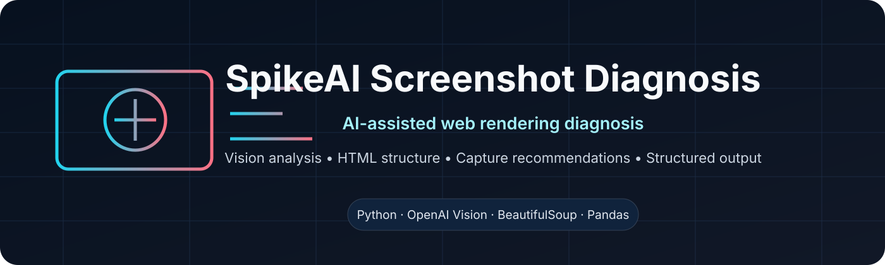

<div align="center">

</div>

# SpikeAI Screenshot Diagnosis

AI-assisted screenshot analysis for diagnosing web-rendering failures and generating capture recommendations from **visual evidence plus HTML structure**.

## Overview

The project analyzes captured web pages using two complementary signals:

1. **Local HTML analysis** extracts structural indicators such as framework hints, loading states, modal/overlay patterns, DOM complexity, repeated content, and selectors.
2. **Vision-model analysis** reviews the screenshot together with the extracted HTML context to classify visible failures and propose more reliable capture strategies.

The result is a structured diagnostic record designed to help debug screenshot pipelines rather than simply label an image as good or bad.

## What it detects

- Blank or partially rendered pages
- Duplicate/repeated content
- Cookie banners, modals, and blocking overlays
- Security/interstitial pages
- JavaScript rendering failures
- Suspicious loading states
- Layout or capture timing problems

## Outputs

For each case the pipeline can produce:

- Structured JSON diagnosis
- Severity and confidence fields
- HTML-derived metadata
- Capture recommendations
- Suggested wait strategies and selectors
- CSV summary suitable for analysis in spreadsheet tools

## Architecture

```text
Screenshot -----------------------------┐
                                       │
HTML file → local structure analysis ──┼→ vision-model prompt
                                       │
                                       ↓
                              structured diagnosis
                                       ↓
                          JSON / CSV / console output
```

Detailed documentation is available in:

- [SYSTEM_ARCHITECTURE.md](SYSTEM_ARCHITECTURE.md)
- [WORKFLOW_EXPLANATION.md](WORKFLOW_EXPLANATION.md)
- [MERMAID_DIAGRAMS.md](MERMAID_DIAGRAMS.md)
- [QUICK_GUIDE.md](QUICK_GUIDE.md)

## Quick start

### 1. Create an environment

```bash
python -m venv .venv
```

Activate it:

```bash
# macOS / Linux
source .venv/bin/activate

# Windows PowerShell
.\.venv\Scripts\Activate.ps1
```

### 2. Install dependencies

```bash
pip install -r requirements.txt
```

### 3. Configure credentials

Copy the example environment file:

```bash
cp .env.example .env
```

Set your model-provider API key in the local `.env` file. Never commit real credentials.

### 4. Add inputs

```text
data/
├── screenshots/   # required image captures
└── html/          # optional matching HTML files
```

### 5. Run

```bash
python web_diagnosis.py
```

Generated results are written under `diagnosis_results/`.

## Example result shape

```json
{
  "analysis": {
    "status": "BROKEN",
    "diagnosis": "The page appears incompletely rendered.",
    "confidence": 0.91
  },
  "capture_recommendations": {
    "top_recommendation": "Wait for a stable content selector before capture.",
    "all_issues": [
      {
        "issue": "Incomplete client-side render",
        "cause": "Capture occurred before dynamic content settled",
        "recommendation": "Use an explicit selector or network-idle condition",
        "severity": "major"
      }
    ]
  }
}
```

## Design choices

### Local analysis first
HTML parsing is deterministic and inexpensive, so the system extracts useful structure before making a model request. This gives the vision model concrete context and makes recommendations more actionable.

### Structured output
The pipeline favors machine-readable fields over free-form prose so results can be compared across many screenshots or exported for downstream analysis.

### Optional HTML context
Screenshot-only diagnosis remains possible, but matched HTML generally provides stronger evidence for capture-timing and selector recommendations.

## Limitations

- Vision-model output is probabilistic and should be reviewed before changing production capture logic.
- HTML heuristics can misidentify frameworks or repeated components.
- A screenshot cannot prove the full runtime state of a web application.
- Provider latency, model behavior, and pricing may change over time.
- This repository does not claim benchmark-level diagnostic accuracy without a labelled evaluation dataset.

## Security and privacy

See [SECURITY.md](SECURITY.md).

Screenshots and HTML can contain personal, confidential, or authenticated content. Before sending data to an external model provider:

- remove secrets and access tokens
- redact personal information where possible
- avoid uploading confidential customer pages without authorization
- review the provider's data-retention settings and terms

Keep `.env` local and never commit API keys.

## Potential improvements

- Add a labelled evaluation dataset and reproducible metrics
- Add unit tests for deterministic HTML analysis
- Add schema validation for model responses
- Add retry/backoff and request timeouts
- Separate model-provider integration behind a small adapter interface

## License

See the repository license if present. If no license is supplied, the default copyright rules apply.
